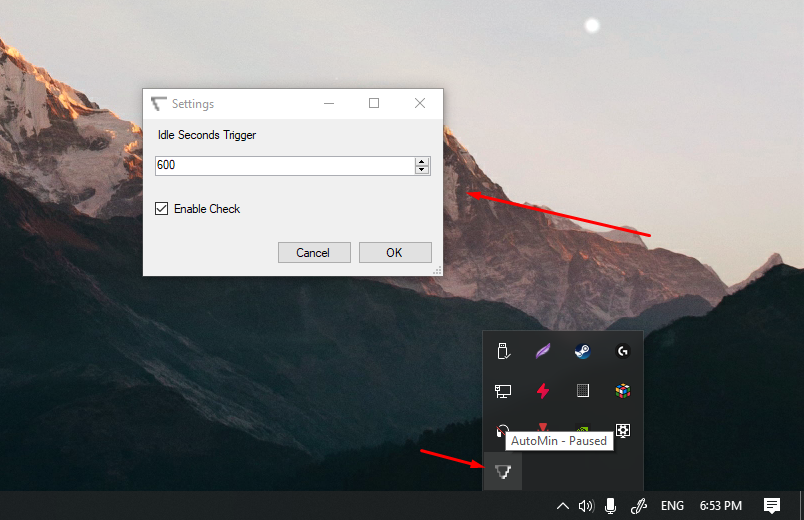

# AutoMin
A very simple tool to automatically show the desktop when the computer is idle

# Context
Recently i installed a software in my computer called "Wallpaper Engine", this is a software that enables the user to use animated and interactive wallpapers on the desktop. The only problem (in my case) is that i don't use to see the desktop very often since i rarelly minimize my applications or either restart my computer.

To solve this problem i created this small tool that when the computer is idle for a certain time it automatically shows up the desktop (just as the user had clicked the bottom-right corner of the screen) and when the user returns to his computer and moves his mouse it restore back all the windows.

# How to compile it?
It is a simple Windows Forms C# application, just open the solution with the visual studio, select release and build the application, the executable show appear in the release folder.

# Todo
- Save the settings as a json file
- Make the restore windows feature be able to be disabled in the settings window
- Create the installer